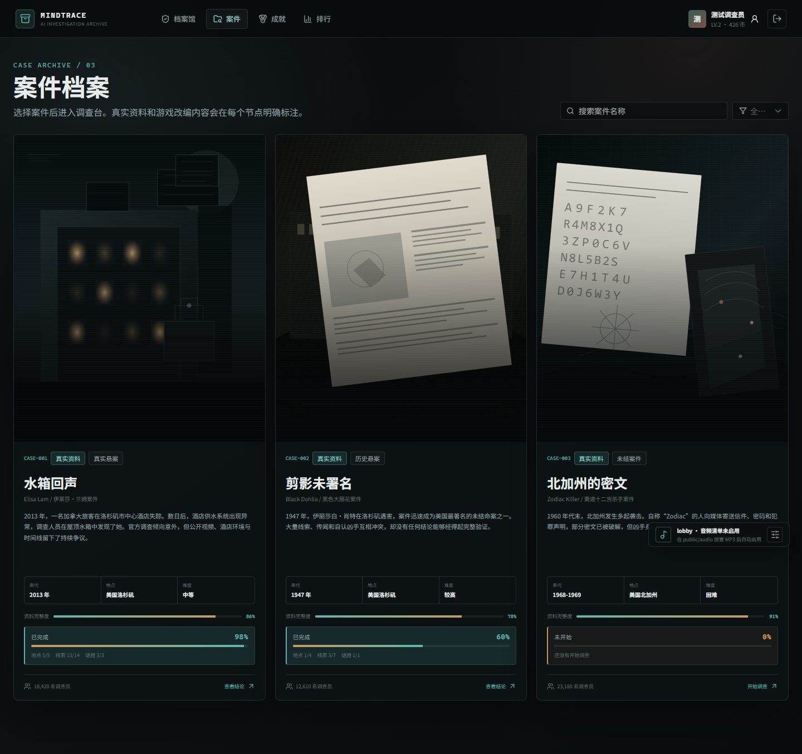
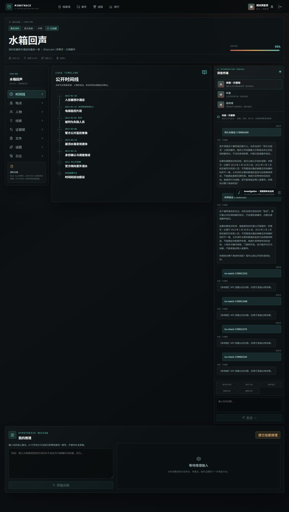
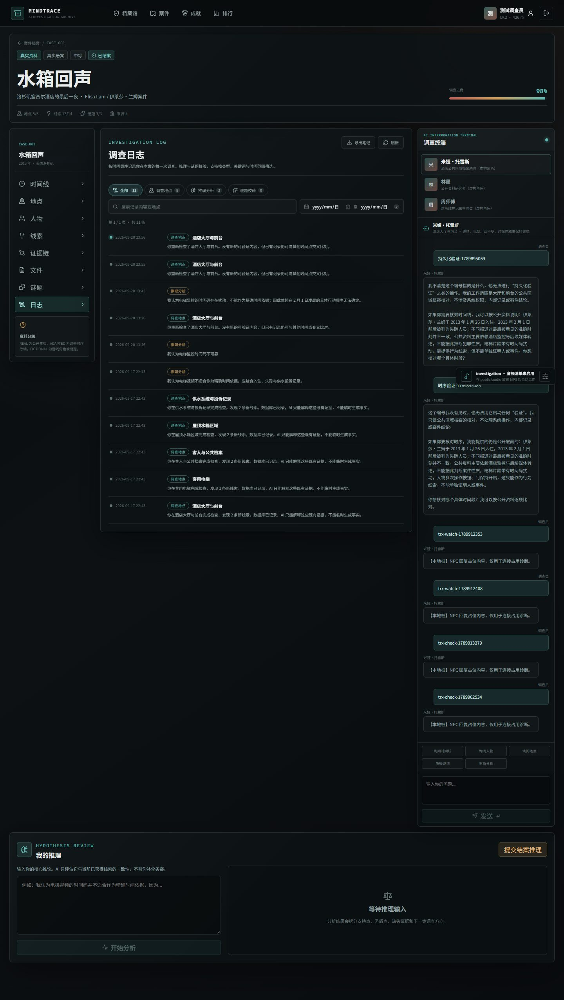
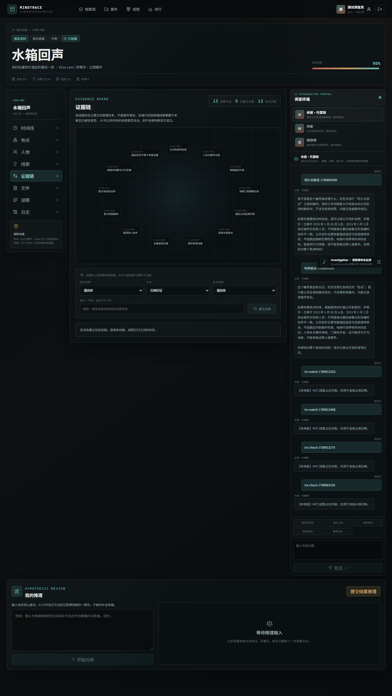
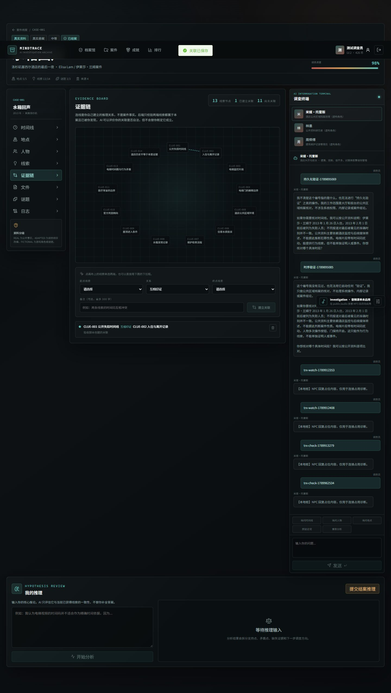
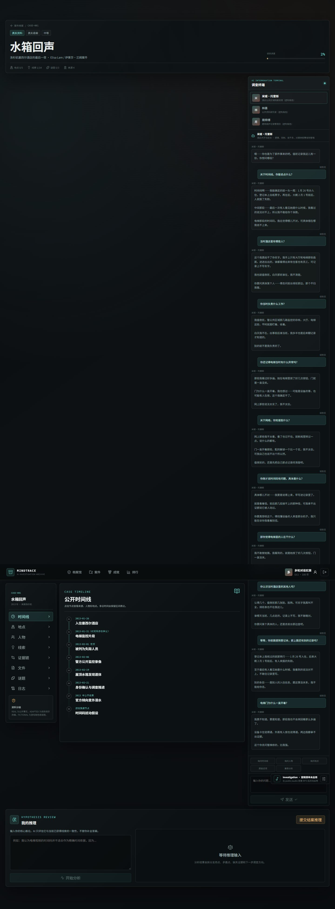
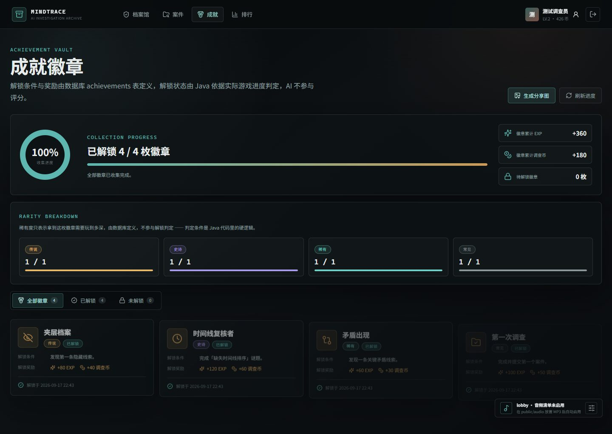
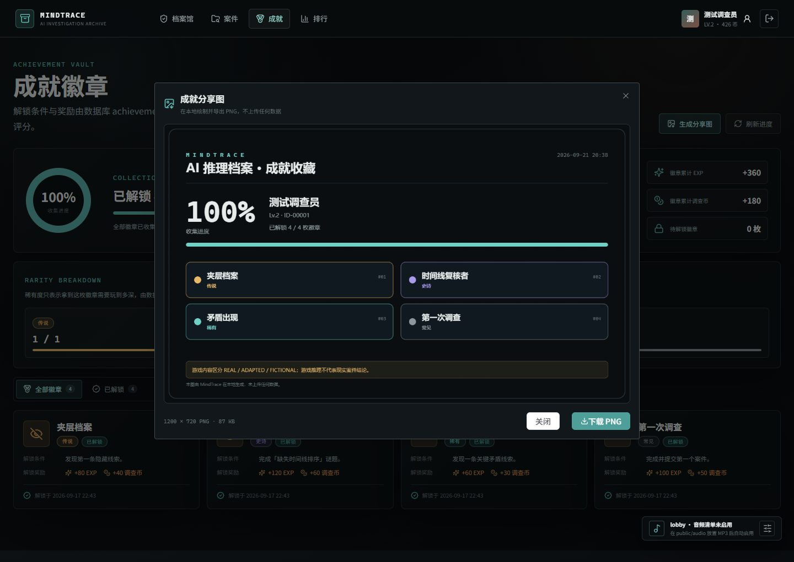

# MindTrace AI 推理档案

> 一款 AI 推理侦探游戏：在真实悬案的公开档案里，勘察现场、访谈 NPC、拼合证据，最后提交你自己的推理。
>
> Vue 3 · Spring Boot · MySQL · DeepSeek API

[](https://vuejs.org/)
[](https://spring.io/projects/spring-boot)
[](https://www.mysql.com/)
[](https://api.deepseek.com)

---

## 项目简介

MindTrace AI 是一款**单人推理侦探游戏**。玩家以调查员身份进入一个案件的公开档案，需要在限定线索中还原时间线、识别信息矛盾，并给出自己的推断结论。

它和普通「AI 聊天套壳」的区别在于：**AI 承担的是有边界的角色，而不是全知问答机器。**

游戏中的 AI 分为三个明确的职责（均对应后端真实方法）：

| AI 角色 | 对应实现 | 它能做什么 | 它**不能**做什么 |
| --- | --- | --- | --- |
| **NPC 对话** | `AgentService.npcReply()` | 以案件相关人的身份、口吻回答提问，只能说出该 NPC 的知识边界内的内容 | 不知道超出其知识范围的事；被追问时会明确表示不确定 |
| **推理分析** | `AgentService.reasoning()` | 评估玩家提出的假设与已有线索是否自洽，指出矛盾点 | 不告诉玩家「正确答案」，不下结论 |
| **结案分析** | `AgentService.finalAnalysis()` | 对玩家提交的推理给出结构化评述 | 不为现实悬案编造犯罪结论 |

**内容伦理**：游戏中三个案件均改编自真实公开档案（Elisa Lam / Black Dahlia / Zodiac）。项目严格区分 **REAL / ADAPTED / FICTIONAL** 三类内容并在界面标注比例；AI 被约束为**不得为现实悬案伪造结论**。这是设计目标，不只是文案承诺——提示词与测试都在守这条线。

---

## 项目截图

> 截图来自自动化验收脚本的真实运行结果（`frontend/scripts/visual-check.mjs`、`e2e-full-loop.mjs` 等）。

### 首页与案件档案




### 案件调查主界面




### 证据板与推理




### AI NPC 对话



### 成就系统




---

## 核心功能

### 已实现

**玩家操作**
- 注册 / 登录（JWT 鉴权）、个人档案
- 浏览案件档案库，查看案件概要、真实背景、内容比例标注
- **地点调查**：在案件地图上逐个勘察地点，满足前置条件后解锁新节点，获得线索
- **线索管理**：自动记录已获线索；线索间可建立关联
- **AI NPC 访谈**：与 7 个案件相关人自由对话，多轮上下文、会话历史可回看
- **谜题系统**：3 种谜题类型（时间线排序 / 证据关联 / 人物关系），提交后判定并给奖励
- **证据板**：自由拖拽建立线索之间的关联，构成自己的证据网络
- **时间线复核**：整理案件时间点
- **提交结案推理**：撰写开放性推理，由 AI 给出结构化评述
- **成就系统**：4 个成就，分 4 个稀有度等级（COMMON / RARE / EPIC / LEGENDARY），支持生成分享图
- **排行榜**：按分数排名
- **背景音乐与音效**：4 个场景音轨，可在设置面板调节音量

**游戏流程**
```
注册/登录 → 选择案件 → 勘察地点（解锁节点）→ 获得线索
    → 访谈 AI NPC（解锁 NPC 专属线索）→ 完成谜题
    → 搭建证据板 → 提交结案推理 → AI 评述 + 成就判定
```

### 尚未实现 / 已知限制

- **音轨 `tension` 已定义但无触发点**——代码中只有 `lobby`、`investigation`、`result` 三处调用，紧张氛围音轨预留未用
- **CASE-002 / CASE-003 没有 `TIME_SORT` 谜题**，该类型目前只有 CASE-001 有，导致「时间线复核者」成就只能从 CASE-001 解锁
- **排行榜只有一个榜单**（按总分），没有分案件或分时段的榜单
- 没有多人/对战玩法，没有关卡编辑器或用户自制案件
- 日志关键词筛选匹配的是展示文本，需扫描最多 2000 条记录；记录量继续增长时应把该文本下沉为独立索引列
- **未部署在线 Demo**：项目需要 MySQL + 后端 + DeepSeek Key，目前只能本地运行

---

## 技术栈与架构

### 技术栈（版本以项目实际配置为准）

**前端**
| 技术 | 版本 | 用途 |
| --- | --- | --- |
| Vue | 3.5.13 | 框架（Composition API） |
| TypeScript | 5.7.2 | 类型系统 |
| Vite | 6.2.4 | 构建与开发服务器 |
| Vue Router | 4.5.0 | 路由 |
| Pinia | 3.0.1 | 状态管理（`auth` / `audio`） |
| Element Plus | 2.9.7 | UI 组件库 |
| Axios | 1.8.4 | HTTP 客户端 |
| lucide-vue-next | 0.468.0 | 图标 |

**后端**
| 技术 | 版本 | 用途 |
| --- | --- | --- |
| Java | 21（`<java.version>`） | 语言版本 |
| Spring Boot | 3.4.5 | 应用框架 |
| Spring Security | — | 鉴权 |
| MyBatis-Plus | spring-boot3-starter | 数据访问 |
| JJWT | — | JWT 签发与校验 |
| MySQL Connector/J | — | 数据库驱动 |
| Maven Wrapper | 3.9.9 | 构建（无需本地装 Maven） |

**数据库**：MySQL 8.x，19 张表

**AI**：DeepSeek Chat Completions API（OpenAI 兼容格式）

### 前后端交互

前端通过 Axios 封装统一调用后端 REST 接口，JWT 放在 `Authorization: Bearer` 头中。

```
Vue 组件 / Pinia store
      ↓  frontend/src/api/index.ts（统一封装）
      ↓  Axios + JWT 拦截器
Spring Boot Controller             ← @RestController，统一 ApiResponse 包装
      ↓
Service 层                         ← 业务逻辑、事务边界
      ↓
MyBatis-Plus Mapper → MySQL
```

- 后端所有响应统一为 `{ success, message, data }` 结构
- 未登录返回 **401**、无权限 **403**、资源不存在 **404**、参数错误 **400**
- 全局异常处理器把异常映射为上述状态码，不把内部实现细节写进响应体

### 后端如何调用 AI

AI 调用集中在 `agent` 与 `deepseek` 两个包，链路清晰分层：

```
Controller（AgentController / CaseController）
      ↓
AgentService            ← 三个入口：npcReply / reasoning / finalAnalysis
      ↓
ContextBuilder          ← 组装上下文：只注入「玩家已获得的线索」
      ↓                    NPC 对话只注入「该 NPC 普通级知识」
PromptBuilder           ← 拼接 system prompt + 上下文 + 历史
      ↓
DeepSeekService         ← HTTP 调用 DeepSeek，构造请求体
      ↓
ConversationMemory      ← 对话持久化（chat_messages 表）
```

三个关键设计约束（都有测试守着）：

1. **AI 只看到玩家应看到的信息**——推理上下文只含玩家已获得的线索；NPC 对话只含该 NPC 的知识边界内的内容
2. **玩家消息必须在调用 AI 之前落库**（`ConversationMemory.saveImmediately`，`REQUIRES_NEW` 事务），避免 AI 超时导致消息丢失
3. **AI 调用留在数据库事务之外**，避免慢 AI 调用长时间占用数据库连接

---

## 项目目录结构

```text
ai-detective/
├── backend/                        Spring Boot 后端
│   ├── src/main/java/com/mindtrace/
│   │   ├── agent/                  AI Agent 链（核心）
│   │   │   ├── AgentService.java       三个 AI 入口 + 降级逻辑
│   │   │   ├── ContextBuilder.java     按权限组装上下文
│   │   │   ├── PromptBuilder.java      提示词拼接
│   │   │   ├── ConversationMemory.java 对话持久化
│   │   │   └── TextStyle.java          文本风格归一化
│   │   ├── controller/             REST 控制器（6 个）
│   │   ├── service/                业务逻辑层
│   │   ├── entity/ mapper/         MyBatis-Plus 实体与 Mapper
│   │   ├── security/               JWT 鉴权与安全配置
│   │   ├── exception/              全局异常处理
│   │   ├── deepseek/               DeepSeek HTTP 客户端
│   │   └── config/ dto/ common/    配置、传输对象、公共类
│   ├── src/test/java/              13 个测试类 / 104 个用例
│   └── pom.xml
│
├── frontend/                       Vue 3 前端
│   ├── src/
│   │   ├── views/                  9 个页面视图
│   │   ├── components/             12 个复用组件
│   │   ├── stores/                 Pinia（auth 鉴权 / audio 音频）
│   │   ├── api/                    Axios 封装与接口定义
│   │   └── router/                 路由与鉴权守卫
│   ├── scripts/                    浏览器端验收脚本（Playwright）
│   ├── public/
│   │   ├── images/                 案件封面 SVG（自制）
│   │   └── audio/                  音轨目录（不含版权音频，见下）
│   └── package.json
│
├── database/
│   ├── schema.sql                  建表脚本
│   ├── data.sql                    种子数据（3 案件 / 26 线索 / 7 NPC / 5 谜题）
│   └── migration-*.sql             增量迁移脚本（幂等）
│
├── scripts/                        启动、验证与计量脚本
│   ├── start-all.ps1               一键启动三端 + 冒烟
│   ├── stop-all.ps1                停止全部服务
│   └── verify-*.py                 接口 / AI / 安全 / 并发验收
│
├── artifacts/                      验收报告（JSON / HTML）
├── docs/                           项目文档与截图
└── .env.example                    环境变量样例（不含真实密钥）
```

---

## 本地运行

### 环境要求

| 组件 | 版本要求 | 说明 |
| --- | --- | --- |
| **JDK** | 17+（推荐 **21**） | `backend/pom.xml` 的 `<java.version>` 为 21 |
| **Node.js** | 18+（建议 20/22） | 前端构建与开发服务器 |
| **MySQL** | **8.x** | 需要可用的 MySQL 实例 |
| **Maven** | 无需安装 | 项目自带 `backend/mvnw.cmd`（Maven Wrapper 3.9.9） |
| **DeepSeek API Key** | 可选 | 不配置也能运行，AI 会降级为本地规则回复 |

### 1. 数据库初始化

```bash
# 1) 创建数据库
mysql -u root -p -e "CREATE DATABASE mindtrace DEFAULT CHARACTER SET utf8mb4;"

# 2) 建表 + 导入种子数据（按顺序）
mysql -u root -p mindtrace < database/schema.sql
mysql -u root -p mindtrace < database/data.sql

# 3) 若库已存在（升级场景），按需执行增量迁移
mysql -u root -p mindtrace < database/migration-2026-09-20-location-nodes.sql
```

> `database/migration-*.sql` 均为**幂等**脚本，重复执行安全。

默认提供演示账号：`demo_investigator` / `demo123`（见 `database/data.sql`）。

### 2. 后端配置与启动

配置项全部支持**环境变量覆盖**（默认值见 `backend/src/main/resources/application.yml`）：

| 变量名 | 默认值 | 说明 |
| --- | --- | --- |
| `DB_URL` | `jdbc:mysql://127.0.0.1:3306/mindtrace?...` | 数据库连接串 |
| `DB_USERNAME` | `root` | 数据库用户 |
| `DB_PASSWORD` | *（空）* | 数据库密码 |
| `DEEPSEEK_API_KEY` | *（空）* | **AI 密钥，不配置则 AI 降级** |
| `DEEPSEEK_BASE_URL` | `https://api.deepseek.com` | API 地址 |
| `DEEPSEEK_MODEL` | `deepseek-flash` | 模型名 |
| `DEEPSEEK_TIMEOUT_SECONDS` | `60` | 超时 |
| `DEEPSEEK_CHAT_MAX_TOKENS` | `1200` | 对话模式 token 上限 |
| `DEEPSEEK_JSON_MAX_TOKENS` | `8000` | JSON 模式 token 上限 |
| `DEEPSEEK_DISABLE_THINKING` | `false` | 是否关闭模型思考过程（**行为变更，见下**） |
| `JWT_SECRET` | *（开发默认值）* | **生产环境必须替换** |
| `JWT_EXPIRATION_HOURS` | `72` | 令牌有效期 |
| `CORS_ALLOWED_ORIGINS` | `http://localhost:5173,http://127.0.0.1:5173` | 允许的前端来源 |
| `SERVER_PORT` | `8080` | 后端端口 |

**提供 API Key 的两种方式：**

```bash
# 方式 A：环境变量（推荐）
export DEEPSEEK_API_KEY="sk-你的密钥"        # Windows CMD: set DEEPSEEK_API_KEY=...
export DB_PASSWORD="你的数据库密码"

# 或复制 .env.example 为 .env 后自行 source / 使用 IDE 环境变量配置
cp .env.example .env
```

**启动后端：**

```bash
cd backend
./mvnw.cmd spring-boot:run           # Windows
./mvnw spring-boot:run                # macOS / Linux
```

启动后验证：

```bash
curl http://127.0.0.1:8080/api/health
# {"success":true,"message":"ok","data":{"status":"UP","deepSeekConfigured":true}}
```

> `deepSeekConfigured:false` 表示 Key 未生效，AI 会走降级路径。

### 3. 前端依赖安装与启动

```bash
cd frontend
npm install
npm run dev          # 开发模式，默认 http://localhost:5173

# 或生产构建 + 预览
npm run build
npm run preview -- --port 5173
```

> 后端 CORS 默认只放行 `5173` 端口，前端请使用该端口。

### ⚠️ 安全提醒

**不要把真实 API Key 提交到 GitHub。**

- `.gitignore` 已排除 `.env`、`.env.local`
- `application.yml` 中所有密钥位都使用环境变量占位，不含明文
- 提交前自查：
  ```bash
  git ls-files | xargs grep -iE "sk-[A-Za-z0-9]{16,}"   # 应为空
  ```

> **待验证**：`vite dev` 在部分受限环境中可能因文件清理策略报错，此时改用 `npm run build && npm run preview`。

---

## 项目亮点

### 1. AI 的能力被明确「关进笼子」

AI 不是全知客服。每轮对话只注入该 NPC 的知识边界内的内容，超出范围时 NPC 会表示不确定而非编造。推理上下文只包含**玩家已实际获得的线索**，防止 AI 因为「知道答案」而泄题。

### 2. 为真实悬案设定了内容伦理边界

游戏改编自真实未结案件。项目用 **REAL / ADAPTED / FICTIONAL** 三级标注每条内容，案件难度与内容比例在数据库中显式存储（如 CASE-001 为 72% / 22% / 6%）。**游戏目标不是「证明某人杀人」，而是整理可验证的时间点与信息缺口。**

### 3. 用测量而不是感觉来优化 AI 成本

项目内置了 token 计量代理（`scripts/deepseek-meter-proxy.mjs`），把成本拆成**缓存命中输入 / 未命中输入 / 输出**三个数字分别测量。基于实测做的两项优化：

- **提示词压缩**：system prompt 从 1294 字压到 1063 字（−17.9%），44 条行为约束零丢失，由 `NpcPromptConstraintTest` 钉住
- **关闭模型思考**：实测 NPC 回复输出 token **−66%**、单轮费用约 **−39%**；JSON 链路输出 **−70%**、费用 **−63%**，行为验证通过后做成**默认关闭的开关**

配套发现：缓存命中价是未命中的 **1/50**，因此「省 token」和「省钱」不是一回事——压提示词省的是最便宜的那部分。

### 4. 工程质量用可执行的验收守住

- **104 个后端单元测试**（13 个测试类，全绿）
- **82 条接口断言**（`scripts/verify-api.ps1`）
- **6 个浏览器端验收脚本**：多页面视觉检查、谜题拖拽、来源链接、NPC 多轮对话、29 项端到端全流程、响应式与降级
- **真实 AI 验收**：`verify-live-ai.py`（对话 / 推理 / 结案 / 多轮上下文 / 防提示词注入）、`verify-npc-voice.py`（7 个角色逐个检验语气）
- **发布前 RC 验收**发现并修复了真实缺陷：未登录返回 403 而非 401、参数错误返回 500 并泄露内部细节、谜题答案超长导致 500、并发写竞态、不存在路径返回 500

### 5. 把「测试本身写错」也当成缺陷处理

开发中多次出现**验收脚本假失败**（断言写错而非应用出错），项目保留了这类记录与修正过程，例如：媒体响应应接受 `206` 而非只认 `200`；`new Audio()` 创建的节点不在 DOM 中，用 `querySelector('audio')` 永远找不到。

---

## 项目状态与已知限制

**状态**：功能完整、可本地运行的**个人作品项目**，已通过多轮自建验收。非生产部署版本。

**已知限制**

- 无在线 Demo（依赖 MySQL + 后端 + DeepSeek Key，需本地运行）
- 未配置 Key 时 AI 降级为本地规则回复，前端会显示 `aiAvailable: false`
- 音轨 `tension` 已预留但无触发点
- CASE-002 / CASE-003 缺少 `TIME_SORT` 谜题
- 并发场景做了竞态修复与压力验证，但未做大规模负载测试
- 前端自动化脚本依赖 Playwright，首次运行需下载浏览器

**后续计划**

- 补充更多案件与谜题类型，为 CASE-002 / CASE-003 补上时间线类谜题
- NPC 关系与信任度做更细粒度建模
- 把日志关键词筛选下沉到 SQL 索引，替换当前的展示文本扫描
- 增加分案件 / 分时段榜单

---

## 文档

- **完整开发文档**：本仓库 README 的「开发者手册」部分见 [`docs/DEVELOPMENT.md`](docs/DEVELOPMENT.md)（含接口清单、验收脚本用法、Token 计量方法、架构决策记录）
- **项目汇报稿**：[`docs/项目汇报稿.md`](docs/项目汇报稿.md)

---

## 说明

本项目为个人学习与作品展示用途。案件内容基于**公开档案与媒体报道**改编，不代表对任何现实案件的事实认定或指控。项目中不含版权音频文件，界面插图与图标为自制或开源图标库。

**尚未添加 LICENSE**——授权方式待定，在此之前默认保留所有权利（All rights reserved）。
